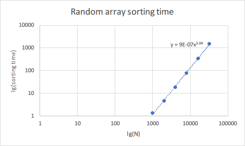

# Assignment 2 - Program Structures & Algorithms Fall 2021

> Name: Zhilue Wang
>
> NUID: 001522973

## Task

- Implement the `Timer` class
- Implement the `InsertionSort` class
- Write code to analyze insertion sort's time complexity

## Conclusion

$$
Average\ time\ complexity = O(n^2)\\
Best\ case = O(n)\\
Worst\ case = O(n^2)
$$

## Evidence

We tested the insertion sort algorithm time usage for six different size of array, with different types of array initialization method - random, ordered, partially ordered, reverse ordered. Each test was run 50 times and we calculated the mean time usage.

The size of array `N` is chosen using doubling method.

Below are the test results (in milliseconds):

|            N            | 1000  | 2000  |  4000  |  8000   |  16000  |  32000   |
| :---------------------: | :---: | :---: | :----: | :-----: | :-----: | :------: |
|      random array       | 1.349 | 4.648 | 18.702 | 78.159  | 341.221 | 1531.445 |
|      ordered array      | 0.005 | 0.008 | 0.016  |  0.031  |  0.049  |  0.117   |
| partially ordered array | 0.602 | 2.444 | 9.344  | 38.983  | 159.053 | 665.519  |
|  reverse ordered array  | 2.342 | 9.217 | 37.424 | 157.718 | 635.131 | 2590.116 |

We can plot it in the log-log graph and use Excel to draw a regression line:
|  |  |
| ------------------------------------------------------------ | ------------------------------------------------------------ |
|  |  |

#### Best case

The best case scenario for insertion sort is when the input array is already a sorted array. For each element, when inserting, it will only need to compare with one element in the sorted array. As shown in the graph, the order of the regression line's formula is `0.9`, which is close to linear relation. So in best case scenario the order of growth is $O(n)$.

#### Average case / Worst case

The average case of insertion sort is just sorting a random array. As shown in the graph, the order of regression line's formula is around `2`.

The worst case of insertion sort is to sort an reverse-ordered array. When inserting a new element to sorted array, it has to be compared to all elements. The order of worst case regression line's formula is still `2`, but the coefficient of the formula is larger than average case.

-- Both average case and worst case have order of growth: $O(n^2)$

## Code

Modified files:

`src/main/.../util/Timer.java`: implement timer class

`src/test/.../util/TimerTest.java`: adjust the unit test threshold

`src/main/.../sort/elementary/InsertionSort.java`: Implement insertion sort algorithm

New files:

`src/main/.../sort/elementary/InsertionSortBenchmark.java`: code for testing insertion sort time complexity

## Unit tests

#### BenchmarkTest:

#### TimerTest:

(The `testRepeat2`  & `testRepeat3` test cases cannot be passed on my PC, so I adjusted the test cases to allow larger delta)

