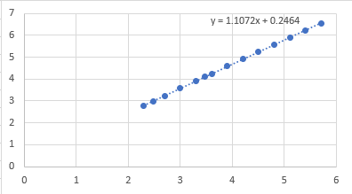
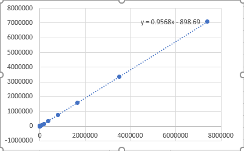

# Assignment 3 - Program Structures & Algorithms Fall 2021

> Name: Zhilue Wang
>
> NUID: 001522973

## Task

- Implement height-weighted quick union with path compression
- Experiments to find out how many operations required to connect all sites

## Conclusion

$$
Number\ of\ pairs\ (m) \approx \frac{1}{2}N\ln (N)
$$

## Evidence

We selected seven different `N` values: 200, 300, 500, 1000, 2000, ..., 1024000, 2048000.

And for each `N` value, we called `count()` method 1000 times and calculate the mean value. Results as below:

| number of sites (N) | number of pairs (m) |  log10(N)   |  log10(m)   | 1/2*N\*ln(N) |
| :-----------------: | :-----------------: | :---------: | :---------: | :----------: |
|         200         |       588.36        | 2.301029996 | 2.769643139 | 529.8317367  |
|         300         |        936.7        | 2.477121255 | 2.97160052  | 855.5673712  |
|         500         |       1692.4        | 2.698970004 | 3.228503017 | 1553.652025  |
|        1000         |       3738.9        |      3      | 3.57274385  | 3453.877639  |
|        2000         |       8181.7        | 3.301029996 | 3.912843551 |  7600.90246  |
|        3000         |        12842        | 3.477121255 | 4.108632666 | 12009.55135  |
|        4000         |        17830        | 3.602059991 | 4.251151343 | 16588.09928  |
|        8000         |        38346        | 3.903089987 | 4.583720068 | 35948.78728  |
|        16000        |        82452        | 4.204119983 | 4.916201195 | 77442.75201  |
|        32000        |       174290        | 4.505149978 | 5.24127247  | 165975.8589  |
|        64000        |       371460        | 4.806179974 | 5.569912054 | 354132.4276  |
|       128000        |       790736        | 5.10720997  | 5.898031511 | 752626.2747  |
|       256000        |       1666575       | 5.408239965 | 6.221824863 | 1593975.389  |
|       512000        |       3522392       | 5.709269961 | 6.546837686 | 3365396.455  |
|       1024000       |       7404624       | 6.010299957 | 6.86950301  | 7085684.267  |

And we plot the N-m data series to log-log graph (in Excel):

The regression line's expression has coefficient as 1.1, which seems like the original relation between `N` and `m` is not linear. (and as we have quite a lot experiment data with large `N` values, this doesn't look like an allowable error)

So the guess is to have one more term combined with linear term, like `N*(another term)`, and this term's growth rate needs to be something closer to `N^0.1`. Here I chose natural log as the extra term. (Why not binary? well the graph doesn't show any property that "something can be split into two things", and as an edge can connect to any other edge, it might be more appropriate to use natural log)

I calculated `N*ln(N)`, which seems quite large. So I divided it by two, and the results are shown in previous data table.

We can plot it against `m`:

Looks pretty close to a 1:1 relation. In fact, if we get rid of those data with small `N` values, the coefficient will get closer to 1.

We can use this `1/2*N*ln(N)` as an approximation of the relation between `N` and `m`. It suggests that, on average, every site in the graph will need to connect to at least `ln(N)` other sites so that the graph will only have one connected component.

## Code

- `UF_HWQUPC` - implement union-find structure
- `UF_Experiment` - UF client file to run experiments. The main function defines a list of N values to run experiments. It might take long time to run it.

## Unit tests

