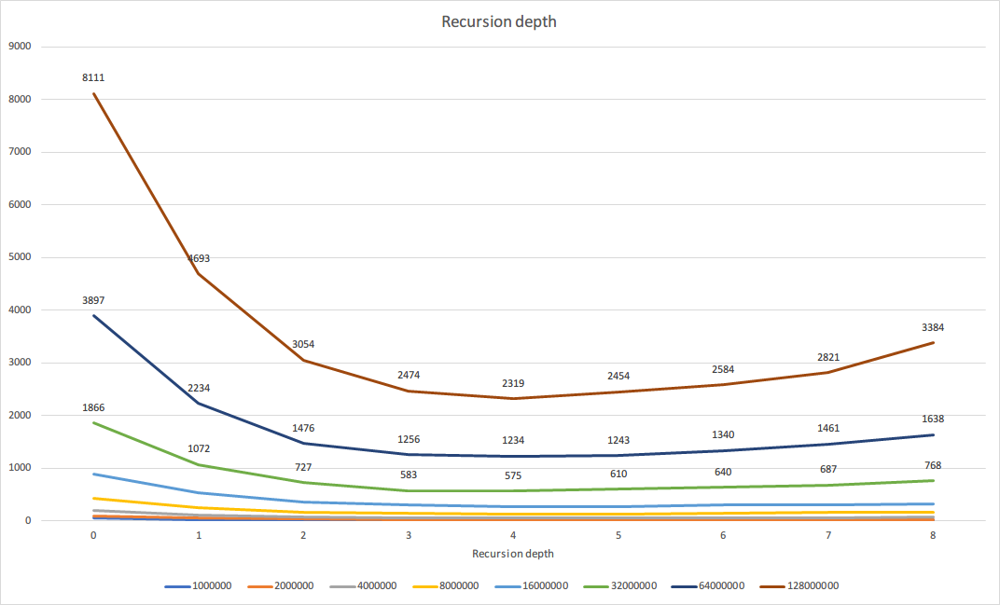

# Assignment 4 - Program Structures & Algorithms Fall 2021

> Name: Zhilue Wang
>
> NUID: 001522973

## Task

- Implement parallel sorting code and experiment code
- Run experiments with different cutoff value and recursion depths

## Conclusion

> Experiments run on PC with 10 cores @ 4.9GHz, results may change in different computers

$$
Best\ recursion\ depth = ceil(log_2(number\ of\ cores))\\
Best\ cutoff\ value = 2500
$$

## Evidence

> Experiment results can be found in `result.xlsx` under same directory as this file

#### Best recursion depth

I ran several experiments with different array size and recursion depth, without cutoff threshold. Here is the result (in ms):

	Array size as data series name

As you can see from the graph, the best recursion depth is 4, which has best performance when array is large enough.

I also tried running this experiment on my Mac but got a different result: 3. The difference between two CPUs are the number of core. Mac's CPU has 8 cores, where PC's got 10 cores. So I consider when we have more CPU cores, we should use more threads so that each CPU core will be assigned a task to be run in parallel. 

When recursion depth gets even larger, there will be overhead partitioning and merging sub-arrays, and there are still only same degree of parallelism as the number of available cores remains the same. So the running time will become longer.

The relation I came up with is as below:
$$
Best\ recursion\ depth = ceil(log_2(number\ of\ cores))
$$

#### Best cutoff value

On the previous graph, depth 0 means there is no parallelism, and depth 1 means it will be ran with 2 threads in parallel. As you can see from the graph, when array size is small, there is no much difference between parallel sort and system sort. In fact, when partitioning and merging sub-arrays, parallel sort will introduce overhead and it will cause the sort slower than system sort, and that's when we need to cutoff to use system sort instead.

Experiments are run with different small array size with depth 0 (system sort) and 1 (parallel sort):

When array size gets to around 2000, parallel sort started to perform better than system sort. In the end, I think 2500 is a good cutoff value to use system sort.

## Code

- `ParSort.java` - added recursion depth config, modified the `parSort` methods to accept a custom `ForkJoinPool`
- `Main.java` - experiments code with different array sizes, different cutoff values, and recursion depths

## Unit tests

- `src/test/java/edu/neu/coe/info6205/sort/parSortTest.java` - to test if parallel sort gives the same result as system sort